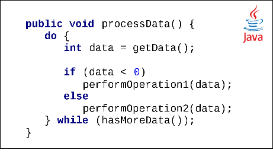
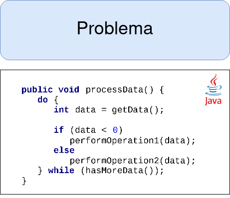
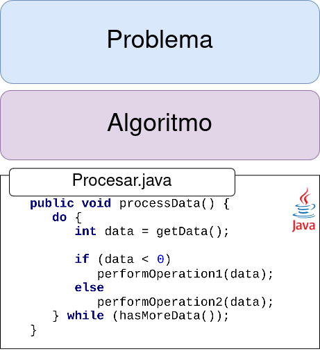
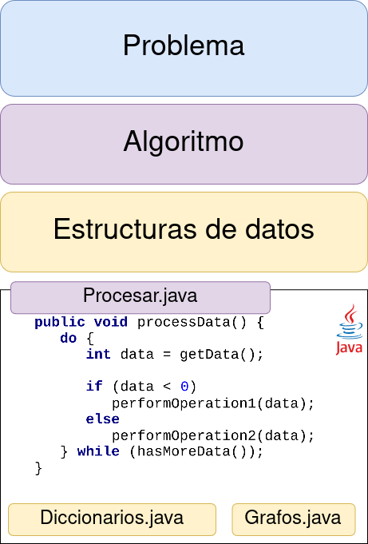
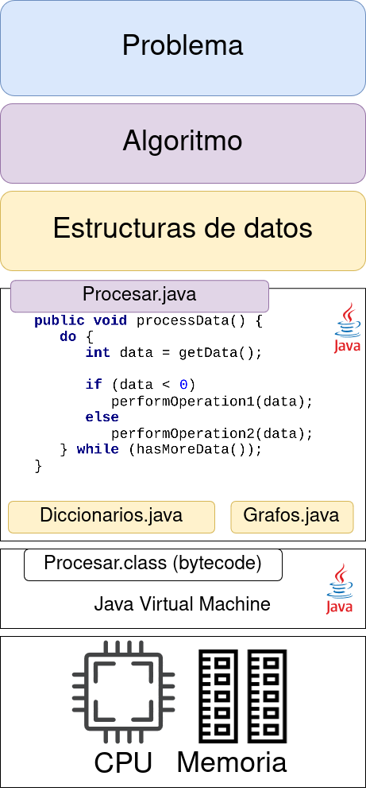
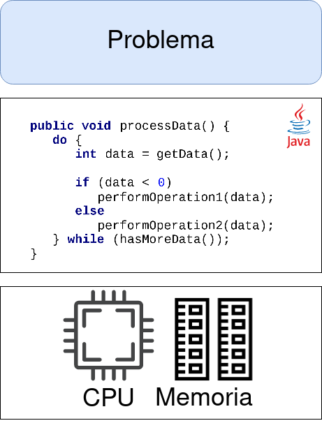
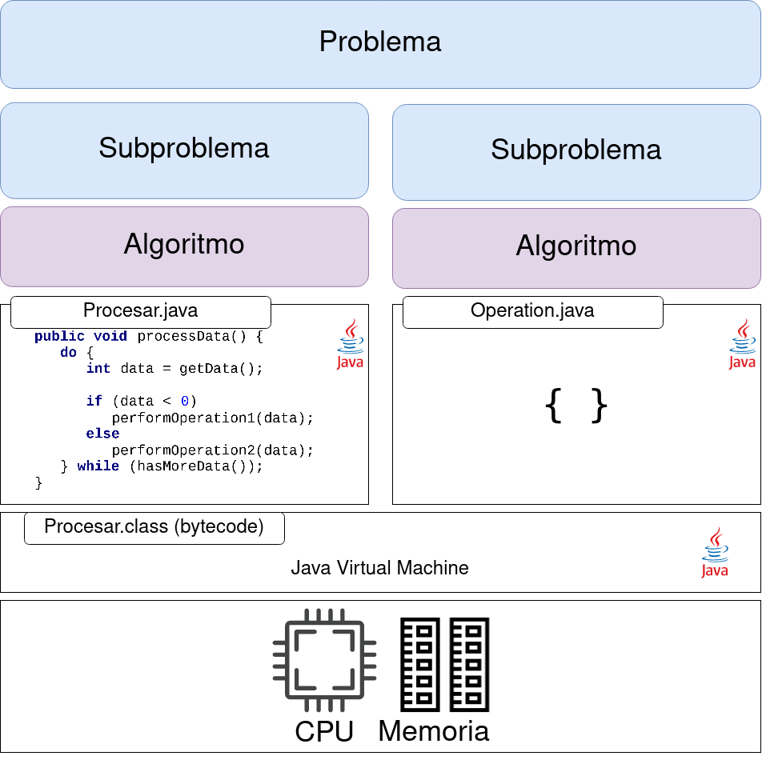
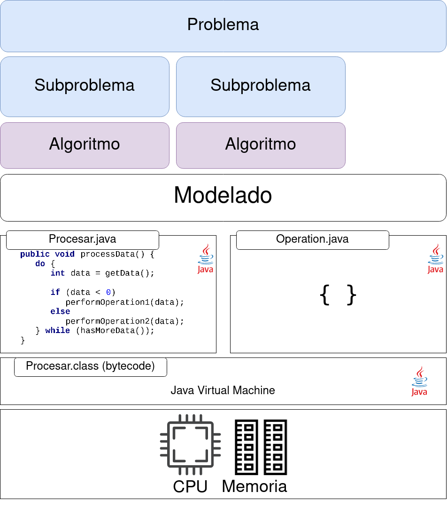
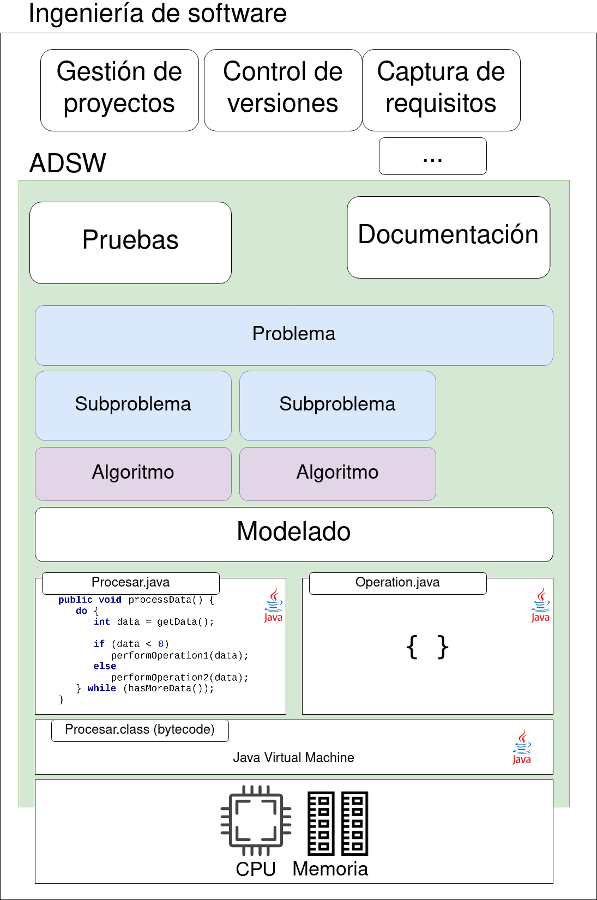

---
title:
- Introducción a ADSW
author:
- Fernando Sánchez
date: Enero 2025
figPrefix: ""

---

\setbeamertemplate{caption}[default]

# Introducción

## Objetivos

- Entender el contexto de ADSW y PROG

---

## Encuesta

{height=80%}

---
# Perspectiva

---

## ¿Qué es la programación?

{height=50%}

---

## ¿Qué es la programación?

{height=80%}

---

## Lo importante es el problema

{height=80%}

---

## El algoritmo

{height=80%}

---

## Estructuras de datos

{height=80%}

---

## ¿Quién ejecuta las acciones?

{height=80%}

---

## Visión simplificada

{height=80%}

---

## Subproblemas

{height=80%}

---

## Modelado en software

{height=80%}

---

## Ingeniería de software

{height=80%}

---

## Problema

Contar el número de veces que se repite alguna línea en un fichero

## Problema

Contar el número de veces que se repite alguna línea en un fichero

Pasos:

- Entender el problema
- Plantear ejemplos simples de entrada / salida
- Separar el problema en subproblemas
- Elegir las estructuras de datos
- Esbozar el algoritmo
- Implementar el código en Java
- Probar el código con los ejemplos simples

---

# Conclusiones

## Resumen

- Contexto de ADSW respecto a ingeniería de software
  - Lo importante es el problema
  - Resulveremos problemas con algoritmos
  - Implementaremos esos algoritmos en código Java

- Importante para atacar un problema
  - Entender el problema completo
  - Plantear ejemplos
  - Si es amplio, separarlo en subproblemas
  - Esbozar el algoritmo antes de escribir código
  - Escribir el código
  - Escribir y lanzar pruebas

---

## Código y ejercicios

- https://github.com/adsw-upm/grupo23
